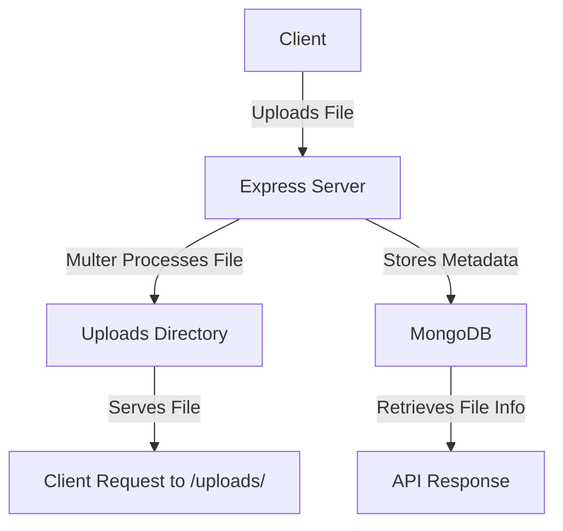

# File Upload API using Express, Multer, and MongoDB

This is a simple Node.js-based file upload API that allows users to upload files (documents, images, videos, etc.) and stores their metadata in MongoDB. The files are saved in an `uploads/` directory and can be retrieved via API.

## Features
- ✅ Supports all types of files (images, videos, PDFs, etc.)
- ✅ Uses **Multer** for handling file uploads
- ✅ Stores file metadata (name, path, type, size) in **MongoDB**
- ✅ Provides API routes to upload and retrieve files
- ✅ Allows serving uploaded files

## Tech Stack
- **Backend:** Node.js, Express.js
- **Database:** MongoDB
- **File Upload Middleware:** Multer

---

## Folder Structure
```
📂 File-Upload-API
│-- 📂 middlewares
│   ├── upload.js  # Multer file upload configuration
│-- 📂 models
│   ├── file.js    # MongoDB Schema for storing file metadata
│-- 📂 routes
│   ├── upload.js  # API routes for handling file uploads
│-- 📂 uploads     # Folder where uploaded files are stored
│-- 📄 .env        # Environment variables
│-- 📄 server.js   # Main server file
│-- 📄 package.json
│-- 📄 README.md   # Documentation
```

---

## Setup and Installation
### 1️⃣ Clone the Repository
```sh
git clone [(https://github.com/Saurabhsaxena81/multerfulldetail)]https://github.com/Saurabhsaxena81/multerfulldetail.git
cd multerfulldetail
```

### 2️⃣ Install Dependencies
```sh
npm install
```

### 3️⃣ Setup Environment Variables
Create a `.env` file in the root directory and add the following:
```env
PORT=3000
MONGO_URI=your_mongodb_connection_string
```

### 4️⃣ Start the Server
```sh
npm start
```
Server will run at `http://localhost:3000`

---

## API Endpoints

### 🔹 Upload a File
**POST** `/api/upload`
- **Body:** Form-Data
  - `file`: (Upload any file)
- **Response:**
```json
{
  "message": "File uploaded successfully",
  "file": {
    "_id": "65a9e3...",
    "filename": "document.pdf",
    "filepath": "uploads/document.pdf",
    "mimetype": "application/pdf",
    "size": 523784
  }
}
```

### 🔹 Get All Uploaded Files
**GET** `/api/files`
- **Response:**
```json
[
  {
    "_id": "65a9e3...",
    "filename": "image.png",
    "filepath": "uploads/image.png",
    "mimetype": "image/png",
    "size": 102400
  }
]
```

### 🔹 Access an Uploaded File
You can access uploaded files at:
```
http://localhost:3000/uploads/yourfile.ext
```

---

## Visualization: File Upload Flow


---

## 📌 Notes
- **Ensure MongoDB is running** before starting the server.
- The uploaded files are stored in the `uploads/` directory.
- You can modify the `upload.js` middleware to allow only specific file types.

---

## 🚀 Future Enhancements
- ✅ Add file size limit
- ✅ Allow file deletion
- ✅ Implement authentication for uploads

---

## 📞 Contact
For any queries, feel free to contact me at [your-email@example.com](mailto:your-email@example.com).

